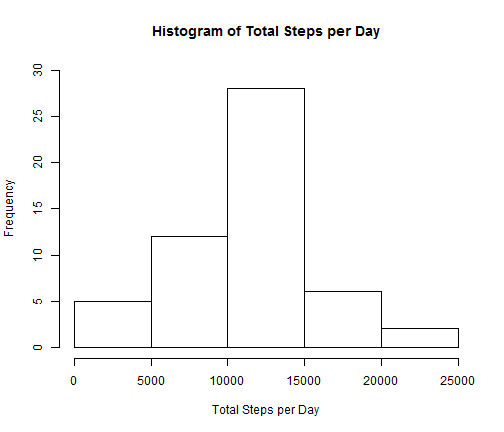
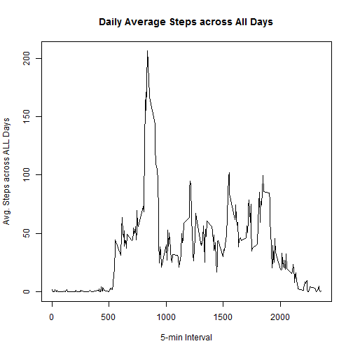
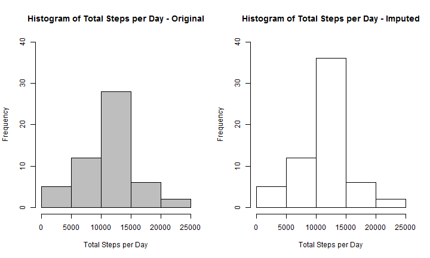
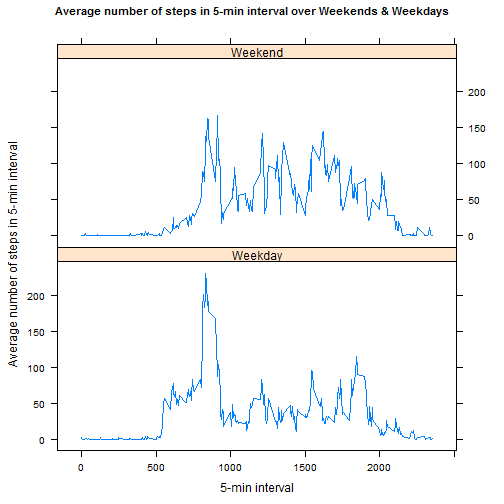

## Reproducible Research: Assignment 1
### Steps taken in 5-min intervals over a period of 2 months

#### Load activity data for this assignment

```r
act_data <- read.csv("activity.csv")
dim(act_data)
```

```
## [1] 17568     3
```

```r
head(act_data)
```

```
##   steps       date interval
## 1    NA 2012-10-01        0
## 2    NA 2012-10-01        5
## 3    NA 2012-10-01       10
## 4    NA 2012-10-01       15
## 5    NA 2012-10-01       20
## 6    NA 2012-10-01       25
```
Looks like there are bunch of "NA"s with some sort of "date" and 5-min intervals.  
First step is to convert the date to a known date format using **lubridate**.

```r
library(lubridate)
act_data$date <- ymd(act_data$date)
class(act_data$date)
```

```
## [1] "POSIXct" "POSIXt"
```
### I. What is mean total number of steps taken per day?
This can be addressed by calculating the sum of steps for each date using **dplyr**.

```r
library(plyr, warn.conflicts = FALSE, quietly = TRUE)
library(dplyr, warn.conflicts = FALSE, quietly = TRUE)
op1 <- act_data %>% group_by(date) %>% summarise_each(funs(sum))
```
Histogram of Total Steps taken each day is shown below.

```r
hist(x = op1$steps,
     main = "Histogram of Total Steps per Day", ylim = c(0,30),
     xlab = "Total Steps per Day")
```

 
  
For Total number of Steps per Day, the **mean** is **10766.19** and **median** is **10765**. 

```r
mean(op1$steps, na.rm = TRUE)
```

```
## [1] 10766.19
```

```r
median(op1$steps, na.rm = TRUE)
```

```
## [1] 10765
```
### II. What is the average daily activity pattern?
This can be addressed by replacing "date" and "sum" with **"interval"** and **"mean"** in the prior calculation.  

```r
op2 <- act_data %>% group_by(interval) %>% summarise_each(funs(mean(., na.rm = TRUE)))
```
Time series plot of average number of steps taken (averaged across all days) on Y-axis and 5-minute interval on x-axis is shown below.  

```r
plot(x=op2$interval, y=op2$steps, type = "l", 
     main = "Daily Average Steps across All Days", 
     xlab = "5-min Interval", ylab = "Avg. Steps across ALL Days")
```

 
  
**Maximum** number of steps occur in 5-min interval **835**.

```r
op2$interval[op2$steps == max(op2$steps)]
```

```
## [1] 835
```
### III. Understanding impact of imputing missing values
Number of missing values / NAs in the original data set is **2304**.  

```r
length(act_data$steps[is.na(act_data$steps) == "TRUE"])
```

```
## [1] 2304
```
This can also be verified from "summary" of original data set  

```r
summary(act_data)
```

```
##      steps             date               interval     
##  Min.   :  0.00   Min.   :2012-10-01   Min.   :   0.0  
##  1st Qu.:  0.00   1st Qu.:2012-10-16   1st Qu.: 588.8  
##  Median :  0.00   Median :2012-10-31   Median :1177.5  
##  Mean   : 37.38   Mean   :2012-10-31   Mean   :1177.5  
##  3rd Qu.: 12.00   3rd Qu.:2012-11-15   3rd Qu.:1766.2  
##  Max.   :806.00   Max.   :2012-11-30   Max.   :2355.0  
##  NA's   :2304
```
Next step is to replace missing values with **mean** of steps taken during "**that** 5-min interval" across all days.    
There are many ways to do this, one of which is to use a **for-loop** to go through the data set with a nested **if-statement** to identify and replace "NA"s with **mean** for "that interval" from "Daily Average Steps across All Days", **i.e. "op2"** from II.  

```r
imp_act_data <- act_data
for (i1 in 1:nrow(imp_act_data)) {
    if (is.na(imp_act_data[i1,1])) {
        imp_act_data[i1,1] <- op2$steps[op2$interval == imp_act_data[i1,3]]
    }
}
```
Check to see if there are any "NA"s - None!   

```r
any(is.na(imp_act_data$steps))
```

```
## [1] FALSE
```
Now **recalculate** "Total Steps" for each day, including mean & median, and **redraw** the histogram.  

```r
op3 <- imp_act_data %>% group_by(date) %>% summarise_each(funs(sum))
mean(op3$steps, na.rm = TRUE)
```

```
## [1] 10766.19
```

```r
median(op3$steps, na.rm = TRUE)
```

```
## [1] 10766.19
```

```r
hist(x = op3$steps, 
     main = "Histogram of Total Steps per Day - Imputed", ylim = c(0,40),
     xlab = "Total Steps per Day")
```

 
  
**Comparing 2 histograms side by side -**

```r
par(mfcol= c(1,2))
hs1 <- hist(x = op1$steps, col = "gray",
     main = "Histogram of Total Steps per Day - Original", ylim = c(0,40),
     xlab = "Total Steps per Day")
hs2 <- hist(x = op3$steps,
     main = "Histogram of Total Steps per Day - Imputed", ylim = c(0,40),
     xlab = "Total Steps per Day")
```

 
  
Looks like the number of days in the 10K-break jumped from high-20s to mid-30s.  
Missing 8 days (2304 NAs / 288 daily intervals) have been imputed with an **"average day"** of the 2-month period with Total Steps of **10766.19**. This can also be observed by comparing the values of the 2 histograms.  

```r
hs_comp_data <- cbind(hs1_breaks = hs1$breaks[c(1:5)], hs1_counts = hs1$counts, 
                      hs2_breaks = hs2$breaks[c(1:5)], hs2_counts = hs2$counts)
hs_comp_data
```

```
##      hs1_breaks hs1_counts hs2_breaks hs2_counts
## [1,]          0          5          0          5
## [2,]       5000         12       5000         12
## [3,]      10000         28      10000         36
## [4,]      15000          6      15000          6
## [5,]      20000          2      20000          2
```
### IV. Are there differences in activity patterns between weekdays and weekends?
Let's add a new factor variable **"day"** in the **imputed** data set with two levels - "weekday" and "weekend" using function weekdays().  
1. Add the new variable **"day"**  
2. Use **for-loop** with a nested **if-statement** to replace days of week with weekend/weekday  
3. Convert new variable to **factor**  

```r
imp_act_data <- mutate(imp_act_data, day = weekdays(date, abbreviate = TRUE))
for (i2 in 1:nrow(imp_act_data)) {
  if (imp_act_data[i2,4] == "Sat" | imp_act_data[i2,4] == "Sun") {
    imp_act_data[i2,4] <- "Weekend"}
  else {imp_act_data[i2,4] <- "Weekday"}
}
imp_act_data$day <- as.factor(imp_act_data$day)
```
Now calculate average number of steps for 5-min intervals, averaged across all weekday days or weekend days.  
In this case, grouping needs to be by "day" **and** "interval".  

```r
op4 <- imp_act_data %>% group_by(day, interval) %>% summarise_each(funs(mean))
```
Time series plot of average number of steps taken, averaged across all weekday or weekend days, on Y-axis & 5-minute interval on X-axis is shown below.

```r
library(lattice)
xyplot(steps ~ interval | day, 
            data = op4, type = "l",
            main = list("Average number of steps in 5-min interval over Weekends & Weekdays",
                        cex = 0.9),
            ylab = "Average number of steps in 5-min interval",
            xlab = "5-min interval",
            layout = c(1,2))
```

 
  
Looks like total number of steps for "an average weekend day" is **12201.52** vs. "an average weekday" is **10255.85**.  
However, max steps for a 5-min interval is greater for weekday vs. weekend; **230.38 vs. 166.64**  
Also, typical activity profile of the individual can be inferred from the time series plot.
